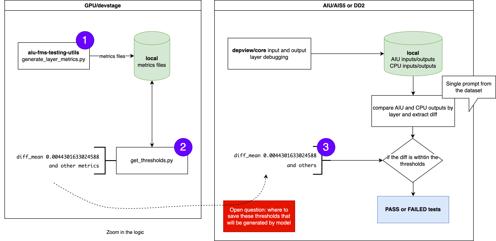
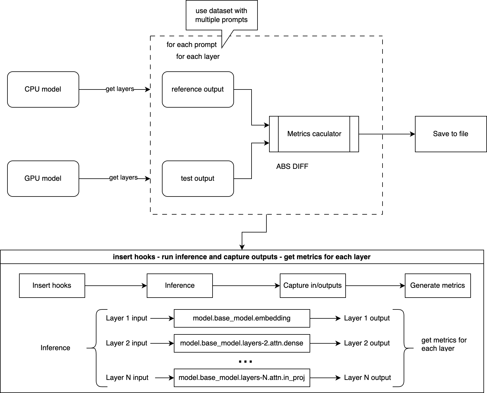
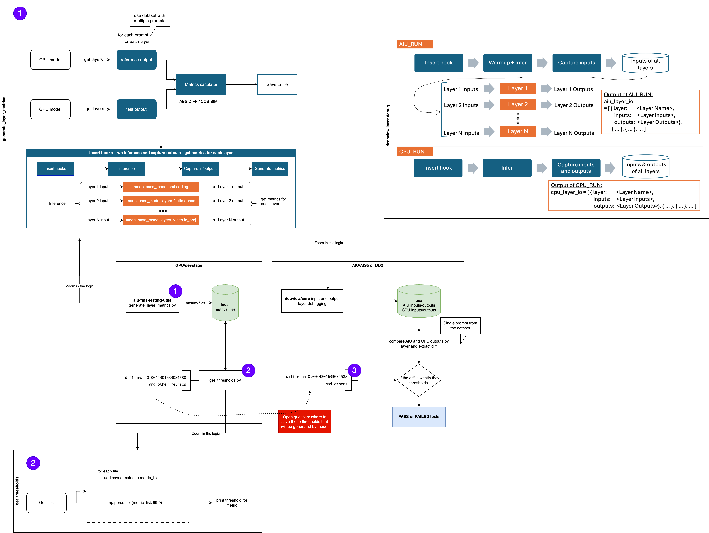

# Layer Metrics Generation

Generate metrics by layers to be used in tests and model enablement debugging. 

1. [Generate metrics by layer in GPU](./LAYERS.md#1-generate-metrics-by-layer)
2. [Get Thresholds](./LAYERS.md#2-get-thresholds)
3. [Apply metrics where needed](./LAYERS.md#3-apply-the-thresholds-where-needed)

The steps as part of the diagram below:

To see the full integration with other debugging tools, check [item 3](./LAYERS.md#3-apply-the-thresholds-where-needed).

## 1. Generate Metrics by Layer

The idea is to run, the prompts through the model with the pre- and post-hooks added, and then get the metrics for the outputs intercepted by each layer, as in this diagram. Then we can have a baseline with CPU/GPU for a failure threshold in AIU tests. Same idea as the [test_decoders.py](https://github.com/foundation-model-stack/aiu-fms-testing-utils/blob/main/tests/models/test_decoders.py), but for each layer. This way we can measure the discrepancies for the outputs and use the thresholds for detailed debugging problems in AIU.



The script [generate_layers_metrics.py](../scripts/generate_layers_metrics.py) requires the following arguments to be run:

```bash
usage: generate_layers_metrics.py [-h] --models MODELS [MODELS ...] --mode
                                  {generate,model-forward} --batch_sizes BATCH_SIZES
                                  [BATCH_SIZES ...] --seq_lengths SEQ_LENGTHS [SEQ_LENGTHS ...]
                                  --max_new_tokens MAX_NEW_TOKENS [MAX_NEW_TOKENS ...]
                                  [--output_path OUTPUT_PATH] [--sharegpt_path SHAREGPT_PATH]

Script to generate the model's metrics by layer

options:
  -h, --help            show this help message and exit
  --models MODELS [MODELS ...]
                        List of models id separated by space. Eg.: ibm-granite/granite-20b-code-
                        instruct-8k /tmp/models/granite-20b-code-cobol-v1
  --mode {generate,model-forward}
                        Sets the output generation mode.
  --batch_sizes BATCH_SIZES [BATCH_SIZES ...]
                        Batch sizes separated by comma.
  --seq_lengths SEQ_LENGTHS [SEQ_LENGTHS ...]
                        Sequence lengths separated by comma.
  --max_new_tokens MAX_NEW_TOKENS [MAX_NEW_TOKENS ...]
                        Max number of generated tokens separated by comma.
  --output_path OUTPUT_PATH
                        Path to save output files
  --sharegpt_path SHAREGPT_PATH
                        Path to sharegpt data json
```

These variables support single and array values.

The argument required for this script is the `--mode`, which is the generation mode desired for the output; The choices can be `generate` or `model-forward`.
- `generate` uses FMS [generate](../scripts/generate_layers_metrics.py#L118); It’s a high-level API that wraps many operations: forward pass, KV cache logic, sampling or greeting decoding, post-processing. 
```python
result = generate(
    model,
    ids,
    max_new_tokens=max_new_tokens,
    use_cache=use_cache,
    do_sample=do_sample,
    max_seq_len=max_seq_len,
    timing="e2e",
    eos_token_id=None,
    contiguous_cache=True,
    extra_kwargs={},
)
```
- `model-forward` will call [model.forward](../scripts/generate_layers_metrics.py#L135); Avoids introducing noise from sampling, past key caching, etc.
```python
result = model.forward(
    ids,
    use_cache=use_cache
    )
```

### How to run

Once all is set up, we can generate the CSV metrics:

```bash
cd aiu-fms-testing-utils/tests/resources

mkdir /tmp/output

python3 generate_layers_metrics.py --mode model-forward --models ibm-granite/granite-3.2-8b-instruct --batch_sizes 1 --seq_lengths 64 --max_new_tokens 128
```
The files should get created at `/tmp/output` dir:
```bash
ibm-granite--granite-3.2-8b-instruct_max-new-tokens-128_batch-size-1_seq-length-64_dtype-float16--model.base_model.layers7.ln.abs_diff.csv
ibm-granite--granite-3.2-8b-instruct_max-new-tokens-128_batch-size-1_seq-length-64_dtype-float16--model.base_model.layers7.ln.cos_sim.csv
ibm-granite--granite-3.2-8b-instruct_max-new-tokens-128_batch-size-1_seq-length-64_dtype-float16--model.base_model.layers8.attn.dense.abs_diff.csv
ibm-granite--granite-3.2-8b-instruct_max-new-tokens-128_batch-size-1_seq-length-64_dtype-float16--model.base_model.layers8.attn.dense.cos_sim.csv
```

## 2. Get Thresholds

To get the second step of the flow and get the thresholds by layer, run:
```bash
cd /aiu-fms-testing-utils/tests/resources

python3 get_thresholds.py --models ibm-granite/granite-3.2-8b-instruct --metrics abs_diff cos_sim --file_base /tmp/output --layer_io
```
It should print the metric of each layer:
```bash
Layer model.base_model.layers25.attn.in_proj.query avg abs_diff = 2.079996666484281
Layer model.base_model.layers25.attn.in_proj.key avg abs_diff = 1.2256532914682756
Layer model.base_model.layers25.attn.in_proj.value avg abs_diff = 0.8446561344670284
Layer model.base_model.layers25.attn.in_proj avg abs_diff = 0.0
Layer model.base_model.layers25.attn.dense avg abs_diff = 0.23142293885894077
Layer model.base_model.layers25.ff_ln avg abs_diff = 0.9550253005897409
Layer model.base_model.layers25.ff_sub_layer.wg avg abs_diff = 1.2256491705546648
Layer model.base_model.layers25.ff_sub_layer.a avg abs_diff = 0.5235781749861929
Layer model.base_model.layers25.ff_sub_layer.w1 avg abs_diff = 1.2707070667436549
Layer model.base_model.layers25.ff_sub_layer.w2 avg abs_diff = 0.5201997339672954
Layer model.base_model.layers25.ff_sub_layer avg abs_diff = 0.5201997339672954
Layer model.base_model.layers26.ln avg abs_diff = 0.04852477119171675
[...]
Layer model.base_model.layers39.attn.in_proj.query avg cos_sim = 0.999176025390625
Layer model.base_model.layers39.attn.in_proj.key avg cos_sim = 0.9991455078125
Layer model.base_model.layers39.attn.in_proj.value avg cos_sim = 0.9986572265625
Layer model.base_model.layers39.attn.in_proj avg cos_sim = 0.0
Layer model.base_model.layers39.attn.dense avg cos_sim = 0.9987258911132812
```
Also, a JSON file is saved to the same output dir. A sample file can be found at: [sample_layer_th.json](https://github.com/flaviabeo/aiu-fms-testing-utils/blob/generate_metrics_layers/tests/resources/sample_layer_th.json)

## 3. Apply the thresholds where needed

In case of AIU debugging tools, the thresholds will be applied to compare AIU outputs with CPU, and then assert if the differences are within the thresholds generated. Below, is an architecture of the full integration:


The box named `deepview layer debug` has the diagram of how the model layers outputs are generated to be compared against the CPU results. This is important so that the debug tools can catch operations and layers that have issues in their enablement for AIU hardware.