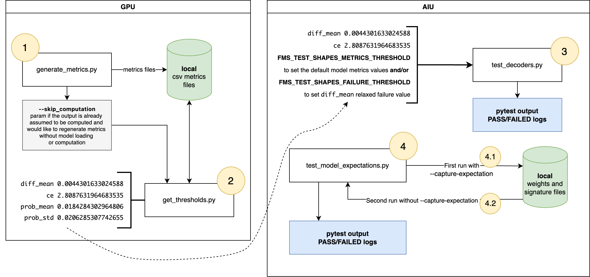

# Model Tests
How to run the pytest test suites at [aiu-fms-testing-utils](https://github.com/aiu-fms-testing-utils/tree/main/tests/models).

1. [Generate metrics in GPU](README.md#1-run-first-on-gpu)
2. [Get Thresholds](README.md#2-get-thresholds)
3. [Apply thresholds into test_decoders](README.md#3-apply-thresholds-in-aiu-test_decoders)
4. [Run test_model_expectations](README.md#4-run-test_model_expectations)



## The test scripts

- **test_decoders** - this will test the decoder models (text-generation) with certain shapes. Most of this is configurable (model, batch_size, prompt_length, max_new_tokens, metrics_thresholds, failure_rate_thresholds, mini models, etc.)
Example:
```bash
# Note: you might need an hf_token if the model requires it (this will download)
export FMS_TEST_SHAPES_COMMON_BATCH_SIZES=1
export FMS_TEST_SHAPES_COMMON_SEQ_LENGTHS=128
export FMS_TEST_SHAPES_COMMON_MODEL_PATHS=/ibm-dmf/models/watsonx/shared/granite-20b-code-cobol-v1/20240603/
export FMS_TEST_SHAPES_USE_MICRO_MODELS=0
pytest tests/models/test_decoders.py
```
The above will test shapes batch_size 1, with sequence length 128 of granite-20b-code-cobol-v1. We can set `FMS_TEST_SHAPES_USE_MICRO_MODELS=0` for not using micro models. Or set it to `FMS_TEST_SHAPES_USE_MICRO_MODELS=1` and add the micro models version to the model paths.

- **test_model_expectations** - this test will capture a snapshot in time of what a randomly initialized model would produce on the AIU. To add a model to this, you simply add it to either the models list or tuple_output_models list which will generate 2 expectation tests. The first time you run this test, you run it with --capture_expectation which will create a resource file with the expected output. The next time you run it, you run without the --capture_expectation and all should pass.

### Thresholds for the tests baselines for `test_decoders`

The `test_decoders.py` file contains tests written for models that have **decoder** architecture. For each model to be tested, specific metrics baselines need to be created by following the next steps in this documentation. Four different metrics are generated with top k per token as base lines for these tests; Cross entropy loss per token, probability mean, probability standard deviation and absolute diff mean.

- **cross_entropy**: Cross entropy is a measure from information theory that quantifies the difference between two probability distributions. Cross entropy serves as a measure of the differences when comparing expected generated tokens and the actual output of the model. Quantifying the distance between the ground-truth distribution and the predicted distribution.
A lower cross entropy indicates a closer match in expected versus generated. 
- **prob_mean**: Probability Mean typically refers to the average probability assigned by the model to a sequence of words or tokens. It's a measure of how well the model understands and predicts language, with lower mean probabilities often indicating a poorer model that struggles to generate coherent or plausible text. 
- **prob_std**: Probability standard deviation assesses how spread out or consistent the model's predictions are when it assigns probabilities to different possible outcomes. A high standard deviation indicates wide variation in the model's certainty, while a low standard deviation suggests more consistent and confident prediction
- **diff_mean**:  The difference of the average or central tendency of a set of data points, often used to measure the model's performance. It can also refer to the intended purpose or interpretation of a text or sentence produced by the model. 

They are calculated in lines [228 - 231 at generate_metrics.py](../scripts/generate_metrics.py#L253) script.
```python
cross_entropy = lambda r, t: torch.nn.CrossEntropyLoss()(r, t.softmax(dim=1).to(dtype=torch.float32))
prob_mean = lambda r, t: torch.mean((r.softmax(dim=1).to(dtype=torch.float32) / t.softmax(dim=1).to(dtype=torch.float32)) - 1.0)
prob_std = lambda r, t: torch.std(r.softmax(dim=1).to(dtype=torch.float32) / t.softmax(dim=1).to(dtype=torch.float32))
diff_mean = lambda r, t: torch.mean(r.softmax(dim=1).to(dtype=torch.float32) - t.softmax(dim=1).to(dtype=torch.float32))
```
More at [pytorch.org](https://pytorch.org/docs/stable/generated/torch.nn.CrossEntropyLoss.html), [Yiren,Wang](https://courses.grainger.illinois.edu/ece598pv/fa2017/Lecture13_LM_YirenWang.pdf), [Li, Wang, Shang Et al.](https://arxiv.org/abs/2412.12177#:~:text=%5B2412.12177%5D%20Model%2Ddiff:,%3E%20cs%20%3E%20arXiv:2412.12177) and [Wu,Hilton](https://arxiv.org/html/2410.13211v1).
</br>

This metrics will be set at the [fail thresholds](./models/test_decoders.py#L146), so **cross_entropy** and **diff_mean** can be used to compare between the GPU generated text output by the same model in AIU. 

## 1. Run first on GPU

Set shapes:
```bash
export MODEL_PATH=/model-path/
export MAX_NEW_TOKENS=128
export BATCH_SIZES=1
export SEQ_LENS=64
export DEFAULT_TYPES="fp16"
export DS_PATH=/resources/sharegpt/share_gpt.json
```

Then run the command for the metrics script:
```bash
python generate_metrics.py --architecture=hf_pretrained --model_path=$MODEL_PATH --tokenizer=$MODEL_PATH --unfuse_weights --output_dir=/tmp/aiu-fms-testing-utils/output/ --compile_dynamic --max_new_tokens=$MAX_NEW_TOKENS --min_pad_length=$SEQ_LENS --batch_size=$BATCH_SIZES --default_dtype=$DEFAULT_TYPES --sharegpt_path=$DS_PATH --num_test_tokens_per_sequence=1024
```

This will generate csv files with the results of the metrics calculation. Typically, this is run with batch size 1, 8 and sequency length 64, 2048 (4 runs in total). Then, we can run [get_thresholds.py](./resources/get_thresholds.py) to summarize the results and get the single values for each metric as the following.
<br>
At the output path, you will see the out and csv files generated as the sample in the following lines:
```bash
--tmp--aiu-fms-testing-utils--models--Mistral-7B-Instruct-v0.3_max-new-tokens-128_batch-size-8_seq-length64_dtype-fp16.ce.csv
--tmp--aiu-fms-testing-utils--models--Mistral-7B-Instruct-v0.3_max-new-tokens-128_batch-size-8_seq-length64_dtype-fp16.cpu_validation_info.0.out
--tmp--aiu-fms-testing-utils--models--Mistral-7B-Instruct-v0.3_max-new-tokens-128_batch-size-8_seq-length64_dtype-fp16.cpu_validation_info.1.out
--tmp--aiu-fms-testing-utils--models--Mistral-7B-Instruct-v0.3_max-new-tokens-128_batch-size-8_seq-length64_dtype-fp16.cpu_validation_info.2.out
--tmp--aiu-fms-testing-utils--models--Mistral-7B-Instruct-v0.3_max-new-tokens-128_batch-size-8_seq-length64_dtype-fp16.cpu_validation_info.3.out
--tmp--aiu-fms-testing-utils--models--Mistral-7B-Instruct-v0.3_max-new-tokens-128_batch-size-8_seq-length64_dtype-fp16.cpu_validation_info.4.out
--tmp--aiu-fms-testing-utils--models--Mistral-7B-Instruct-v0.3_max-new-tokens-128_batch-size-8_seq-length64_dtype-fp16.cpu_validation_info.5.out
--tmp--aiu-fms-testing-utils--models--Mistral-7B-Instruct-v0.3_max-new-tokens-128_batch-size-8_seq-length64_dtype-fp16.cpu_validation_info.6.out
--tmp--aiu-fms-testing-utils--models--Mistral-7B-Instruct-v0.3_max-new-tokens-128_batch-size-8_seq-length64_dtype-fp16.cpu_validation_info.7.out
--tmp--aiu-fms-testing-utils--models--Mistral-7B-Instruct-v0.3_max-new-tokens-128_batch-size-8_seq-length64_dtype-fp16.cuda_validation_info.0.out
--tmp--aiu-fms-testing-utils--models--Mistral-7B-Instruct-v0.3_max-new-tokens-128_batch-size-8_seq-length64_dtype-fp16.cuda_validation_info.1.out
--tmp--aiu-fms-testing-utils--models--Mistral-7B-Instruct-v0.3_max-new-tokens-128_batch-size-8_seq-length64_dtype-fp16.cuda_validation_info.2.out
--tmp--aiu-fms-testing-utils--models--Mistral-7B-Instruct-v0.3_max-new-tokens-128_batch-size-8_seq-length64_dtype-fp16.cuda_validation_info.3.out
--tmp--aiu-fms-testing-utils--models--Mistral-7B-Instruct-v0.3_max-new-tokens-128_batch-size-8_seq-length64_dtype-fp16.cuda_validation_info.4.out
--tmp--aiu-fms-testing-utils--models--Mistral-7B-Instruct-v0.3_max-new-tokens-128_batch-size-8_seq-length64_dtype-fp16.cuda_validation_info.5.out
--tmp--aiu-fms-testing-utils--models--Mistral-7B-Instruct-v0.3_max-new-tokens-128_batch-size-8_seq-length64_dtype-fp16.cuda_validation_info.6.out
--tmp--aiu-fms-testing-utils--models--Mistral-7B-Instruct-v0.3_max-new-tokens-128_batch-size-8_seq-length64_dtype-fp16.cuda_validation_info.7.out
--tmp--aiu-fms-testing-utils--models--Mistral-7B-Instruct-v0.3_max-new-tokens-128_batch-size-8_seq-length64_dtype-fp16.diff_mean.csv
--tmp--aiu-fms-testing-utils--models--Mistral-7B-Instruct-v0.3_max-new-tokens-128_batch-size-8_seq-length64_dtype-fp16.prob_mean.csv
--tmp--aiu-fms-testing-utils--models--Mistral-7B-Instruct-v0.3_max-new-tokens-128_batch-size-8_seq-length64_dtype-fp16.prob_std.csv
```
## 2. Get Thresholds
Get the thresholds by running the [get_thresholds.py](./resources/get_thresholds.py):
```bash
python3 get_thresholds.py --models /tmp/aiu-fms-testing-utils/models/model-name-version-v1 --metrics diff_mean ce --file_base /tmp/aiu-fms-testing-utils/output
```
After running these scripts in namespace with 1 GPU, these were the thresholds generated:

```bash
python3 get_thresholds.py --models /tmp/aiu-fms-testing-utils/models/Mistral-7B-Instruct-v0.3 --metrics diff_mean ce --file_base /tmp/aiu-fms-testing-utils/output
found 7 metric files
--tmp--aiu-fms-testing-utils--models--Mistral-7B-Instruct-v0.3 diff_mean -1.0710003217617725e-08 0.0007839603102183846
found 7 metric files
--tmp--aiu-fms-testing-utils--models--Mistral-7B-Instruct-v0.3 ce 2.8364005851745624
```

These can now be used for the model testing scripts at AIU.

## 3. Apply thresholds in AIU `test_decoders`

These are the variables set at the deployment:

| Name        | Value
| ------------- | ---------------- 
| FMS_TEST_SHAPES_COMMON_MODEL_PATHS        | mistralai/Mistral-7B-Instruct-v0.3
| FMS_TEST_SHAPES_FORCE_VALIDATION_LEVEL_1     | 1
| FMS_TEST_SHAPES_COMMON_BATCH_SIZES           | 1
| FMS_TEST_SHAPES_COMMON_SEQ_LENGTHS      | 64
| FMS_TEST_SHAPES_COMMON_MAX_NEW_TOKENS      | 16
| FMS_TEST_SHAPES_USE_MICRO_MODELS  | 0
| FMS_TEST_SHAPES_METRICS_THRESHOLD | 2.8364005851745624,0.0007839603102183846


> Set `FMS_TEST_SHAPES_METRICS_THRESHOLD` in case there is no need to add the model to the default ones. No code changes needed, just this environment variable set with the metrics values.

Add the new numbers at the end of the [dictionary](./models/test_decoders.py#L116):
```python
# thresholds are chosen based on 1024 tokens per sequence
# 1% error threshold rate between cpu fp32 and cuda fp16
# if a models failure thresholds do not exist in this dict, default to the default_metrics_threshold defined above
# threshold key is (model_id, is_tiny_model)
fail_thresholds = {
    (LLAMA_3p1_8B_INSTRUCT, True): (
        3.7392955756187423,
        .001, # FIXME: compute
    ),
    (GRANITE_3p2_8B_INSTRUCT, True): (
        2.996668996810913,
        .001, # FIXME: compute
    ),
    (GRANITE_20B_CODE_INSTRUCT_8K, True): (
        3.7392955756187423, # FIXME: compute -- setting to micro llama 3.1 8b instruct
        .001, # FIXME: compute
    ),
    (LLAMA_3p1_70B_INSTRUCT, True): (
        3.8235735702514626,
        .001, # FIXME: compute
    ),
    (LLAMA_3p1_8B_INSTRUCT, False): (
        2.6994638133048965,
        0.00047589250549208347,
    ),
    (GRANITE_3p2_8B_INSTRUCT, False): (
        2.3919514417648315,
        0.0005767398688476533,
    ),
    (GRANITE_20B_CODE_INSTRUCT_8K, False): (
        2.640706129074097,
        0.00034344267623964697,
    ),
    (LLAMA_3p1_70B_INSTRUCT, False): (
        2.841279556751251,
        0.0044301633024588115,
    ),
}
```

The command to run is:
```bash
pytest tests/models/test_decoders.py -vv
```
Add the `-vv` for verbose output.

### Test Results Samples

Here is a result sample of the test outputs:

```bash
Starting to run pytest tests/models/test_decoders.py
[ 0/ 1]: Sentient AIU: Enabled
============================= test session starts ==============================
platform linux -- Python 3.11.9, pytest-8.3.5, pluggy-1.5.0
rootdir: /tmp/aiu-fms-testing-utils
plugins: durations-1.4.0, env-1.1.5
collected 1 item

tests/models/test_decoders.py .                                          [100%]

=============================== warnings summary ===============================
../foundation-model-stack/fms/triton/pytorch_ops.py:103
  /tmp/foundation-model-stack/fms/triton/pytorch_ops.py:103: FutureWarning: `torch.library.impl_abstract` was renamed to `torch.library.register_fake`. Please use that instead; we will remove `torch.library.impl_abstract` in a future version of PyTorch.
    @torch.library.impl_abstract("moe::moe_mm")

-- Docs: https://docs.pytest.org/en/stable/how-to/capture-warnings.html
============================= fixture duration top =============================
total          name               num avg            min           
0:00:00.000140        grand total   5 0:00:00.000014 0:00:00.000012
============================ test call duration top ============================
total          name               num avg            min           
0:02:18.965102 test_common_shapes   1 0:02:18.965102 0:02:18.965102
0:02:18.965102        grand total   1 0:02:18.965102 0:02:18.965102
=========================== test setup duration top ============================
total          name               num avg            min           
0:00:00.000553        grand total   1 0:00:00.000553 0:00:00.000553
========================== test teardown duration top ==========================
total          name               num avg            min           
0:00:00.000969        grand total   1 0:00:00.000969 0:00:00.000969
=================== 1 passed, 1 warning in 140.35s (0:02:20) ===================
Finished running pytests
```
In case the thresholds fails:
```bash
[ 0/ 1]: testing model=/mnt/aiu-models-en-shared/models/hf/Mistral-7B-Instruct-v0.3, batch_size=1, seq_length=64, max_new_tokens=16, micro_model=False
[ 0/ 1]: AIU warmup
Using AIU_TOPO_FILE=/etc/aiu/topo.json
[ 0/ 1]: PT compile complete, took 211.912s
[ 0/ 1]: cpu validation info extracted for validation level 0 and validation level 1 (iter=0)
[ 0/ 1]: aiu validation info extracted for validation level 0
[ 0/ 1]: failed validation level 0, testing validation level 1
[ 0/ 1]: aiu validation info extracted for validation level 1 - iter=0
[ 0/ 1]: cpu validation info extracted for validation level 1 - iter=1
[ 0/ 1]: aiu validation info extracted for validation level 1 - iter=1
[ 0/ 1]: cpu validation info extracted for validation level 1 - iter=2
[...] (iteractions removed for better readability)
[ 0/ 1]: aiu validation info extracted for validation level 1 - iter=60
[ 0/ 1]: cpu validation info extracted for validation level 1 - iter=61
[ 0/ 1]: aiu validation info extracted for validation level 1 - iter=61
[ 0/ 1]: cpu validation info extracted for validation level 1 - iter=62
[ 0/ 1]: aiu validation info extracted for validation level 1 - iter=62
[ 0/ 1]: cpu validation info extracted for validation level 1 - iter=63
[ 0/ 1]: aiu validation info extracted for validation level 1 - iter=63
[ 0/ 1]: mean diff failure rate: 0.7638888888888888
[ 0/ 1]: cross entropy loss failure rate: 0.000992063492063492
===================================================================================== fixture duration top =====================================================================================
total          name               num avg            min           
0:00:00.000130        grand total   5 0:00:00.000012 0:00:00.000009
==================================================================================== test call duration top ====================================================================================
total          name               num avg            min           
0:16:31.480337 test_common_shapes   1 0:16:31.480337 0:16:31.480337
0:16:31.480337        grand total   1 0:16:31.480337 0:16:31.480337
=================================================================================== test setup duration top ====================================================================================
total          name               num avg            min           
0:00:00.000555        grand total   1 0:00:00.000555 0:00:00.000555
================================================================================== test teardown duration top ==================================================================================
total          name               num avg            min           
0:00:00.001416        grand total   1 0:00:00.001416 0:00:00.001416
=================================================================================== short test summary info ====================================================================================
FAILED tests/models/test_decoders.py::test_common_shapes[/mnt/aiu-models-en-shared/models/hf/Mistral-7B-Instruct-v0.3-1-64-16] - AssertionError: failure rate for mean diff was too high: 0.7638888888888888
assert 0.7638888888888888 < 0.01
```
## 4. Run `test_model_expectations`

- First add the desired model to the [decoder_models](./models/test_model_expectations.py#L55) variable.
- If the models tested are too big, it is a valid option to add the micro model version for this specific test.
- 4.1 Run `pytest tests/models/test_model_expectations.py::TestAIUDecoderModels -vv --capture_expectation` to save the model weights.
After that you will get an output like this:
```bash
FAILED tests/models/test_model_expectations.py::TestAIUDecoderModels::test_model_output[/ibm-dmf/models/watsonx/shared/granite-20b-code-cobol-v1/20240603-True] - Failed: Signature file has been saved, please re-run the tests without --capture_expectation
FAILED tests/models/test_model_expectations.py::TestAIUDecoderModels::test_model_weight_keys[/ibm-dmf/models/watsonx/shared/granite-20b-code-cobol-v1/20240603-True] - Failed: Weights Key file has been saved, please re-run the tests without --capture_expectation
```
This will tell that the weights and signature have been saved, so you can run the complete suite again to get the tests results.
- 4.2 Then running the complete suit:

```bash
[1000780000@e2e-vllm-dt2-5f8474666c-6zwzb aiu-fms-testing-utils]$ pytest tests/models/test_model_expectations.py -vv
[ 0/ 1]: Sentient AIU: Enabled
=========================================================================== test session starts ============================================================================
platform linux -- Python 3.11.9, pytest-8.3.5, pluggy-1.5.0 -- /usr/bin/python3.11
cachedir: .pytest_cache
rootdir: /tmp/aiu-fms-testing-utils
plugins: durations-1.4.0, env-1.1.5
collected 6 items                                                                                                                                                          

tests/models/test_model_expectations.py::TestAIUDecoderModels::test_model_output[/ibm-dmf/models/watsonx/shared/granite-20b-code-cobol-v1/20240603-False] <- ../foundation-model-stack/fms/testing/_internal/model_test_suite.py PASSED [ 16%]
tests/models/test_model_expectations.py::TestAIUDecoderModels::test_model_weight_keys[/ibm-dmf/models/watsonx/shared/granite-20b-code-cobol-v1/20240603-False] <- ../foundation-model-stack/fms/testing/_internal/model_test_suite.py PASSED [ 33%]
tests/models/test_model_expectations.py::TestAIUDecoderModels::test_model_unfused[/ibm-dmf/models/watsonx/shared/granite-20b-code-cobol-v1/20240603] SKIPPED (All AIU
models are already unfused)                                                                                                                                          [ 50%]
tests/models/test_model_expectations.py::TestAIUModelsTupleOutput::test_model_output[/ibm-dmf/models/watsonx/shared/granite-20b-code-cobol-v1/20240603-False] <- ../foundation-model-stack/fms/testing/_internal/model_test_suite.py PASSED [ 66%]
tests/models/test_model_expectations.py::TestAIUModelsTupleOutput::test_model_weight_keys[/ibm-dmf/models/watsonx/shared/granite-20b-code-cobol-v1/20240603-False] <- ../foundation-model-stack/fms/testing/_internal/model_test_suite.py PASSED [ 83%]
tests/models/test_model_expectations.py::TestAIUModelsTupleOutput::test_model_unfused[/ibm-dmf/models/watsonx/shared/granite-20b-code-cobol-v1/20240603] SKIPPED     [100%]

============================================================================= warnings summary =============================================================================
../foundation-model-stack/fms/triton/pytorch_ops.py:103
  /tmp/foundation-model-stack/fms/triton/pytorch_ops.py:103: FutureWarning: `torch.library.impl_abstract` was renamed to `torch.library.register_fake`. Please use that instead; we will remove `torch.library.impl_abstract` in a future version of PyTorch.
    @torch.library.impl_abstract("moe::moe_mm")

-- Docs: https://docs.pytest.org/en/stable/how-to/capture-warnings.html
=========================================================================== fixture duration top ===========================================================================
total          name                                        num avg            min           
0:02:30.506714                                       model   2 0:01:15.253357 0:01:13.374073
0:01:03.468178                         uninitialized_model   2 0:00:31.734089 0:00:31.329795
0:03:33.976530                                 grand total  12 0:00:00.000702 0:00:00.000018
========================================================================== test call duration top ==========================================================================
total          name                                        num avg            min           
0:00:02.528784            TestAIUModels::test_model_output   1 0:00:02.528784 0:00:02.528784
0:00:02.238001 TestAIUModelsTupleOutput::test_model_output   1 0:00:02.238001 0:00:02.238001
0:00:04.771857                                 grand total   6 0:00:00.002428 0:00:00.000078
========================================================================= test setup duration top ==========================================================================
total          name                                        num avg            min           
0:00:00.003333                                 grand total   6 0:00:00.000203 0:00:00.000076
======================================================================== test teardown duration top ========================================================================
total          name                                        num avg            min           
0:00:00.000512                                 grand total   6 0:00:00.000066 0:00:00.000032
=========================================================== 4 passed, 2 skipped, 1 warning in 219.85s (0:03:39) ============================================================
```

In this case, the model tested was a decoder model with a single output, the TestAIUDecoderModels is the most important case. In the next section, check the applicability for the [TestAIUModelsTupleOutput](./README.md#case-of-multiple-output---testaiumodelstupleoutput) cases.

#### Case of multiple output - TestAIUModelsTupleOutput

The case **TestAIUModelsTupleOutput** is applicable if the model being tested has output of more than one tensor. Like the model in the example default [tuple_output_models](./models/test_model_expectations.py#L76), is a RoBERTa model that can output in this different format.

- Add the model also to [tuple_output_models](./models/test_model_expectations.py#L76).
- 4.1 Run `pytest tests/models/test_model_expectations.py::TestAIUModelsTupleOutput --capture_expectation` to save the model weights;

```bash 
tests/models/test_model_expectations.py::TestAIUModelsTupleOutput::test_model_output[/ibm-dmf/models/watsonx/shared/granite-20b-code-cobol-v1/20240603-False] <- ../foundation-model-stack/fms/testing/_internal/model_test_suite.py PASSED [ 66%]
tests/models/test_model_expectations.py::TestAIUModelsTupleOutput::test_model_weight_keys[/ibm-dmf/models/watsonx/shared/granite-20b-code-cobol-v1/20240603-False] <- ../foundation-model-stack/fms/testing/_internal/model_test_suite.py PASSED [ 83%]
tests/models/test_model_expectations.py::TestAIUModelsTupleOutput::test_model_unfused[/ibm-dmf/models/watsonx/shared/granite-20b-code-cobol-v1/20240603] SKIPPED     [100%]
```

> When adding new models expectations, please include in the PR with capture expectation tests added, the date of the image used to generate the file.

Check this example of a PR for adding a new model expectations' files and results [here](https://github.com/foundation-model-stack/aiu-fms-testing-utils/pull/48).